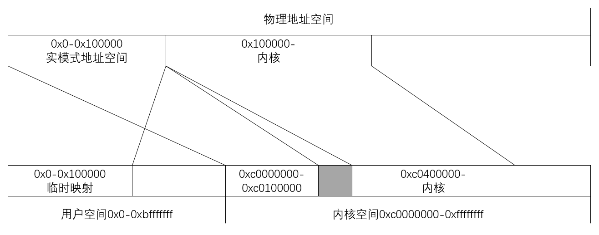
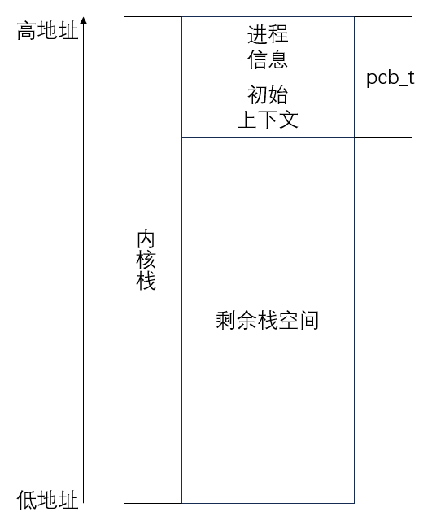
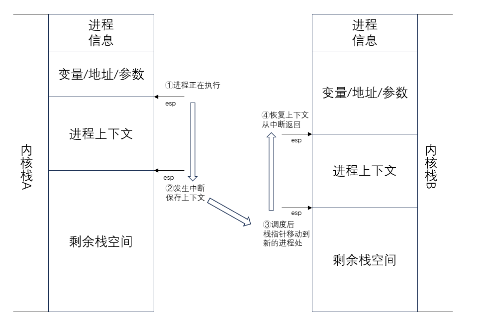
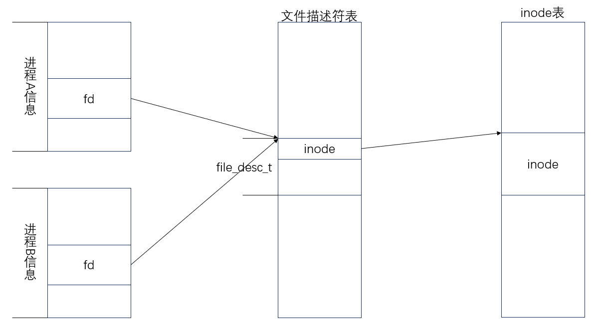

# 简单操作系统 Demo 项目文档

## 目录
- [简单操作系统 Demo 项目文档](#简单操作系统-demo-项目文档)
	- [目录](#目录)
	- [项目概述](#项目概述)
	- [环境搭建](#环境搭建)
		- [仿真环境](#仿真环境)
		- [开发环境](#开发环境)
	- [进入内核前的工作](#进入内核前的工作)
		- [制作mbr](#制作mbr)
		- [制作loader](#制作loader)
	- [制作内核](#制作内核)
		- [准备真正的gdt段表和页表](#准备真正的gdt段表和页表)
			- [gdt段表](#gdt段表)
			- [页表](#页表)
		- [多进程](#多进程)
			- [中断](#中断)
			- [时钟中断](#时钟中断)
			- [进程结构](#进程结构)
			- [调度](#调度)
			- [内核级多进程切换的完整过程](#内核级多进程切换的完整过程)
		- [系统调用](#系统调用)
		- [输入输出系统](#输入输出系统)
			- [键盘中断](#键盘中断)
			- [tty设置](#tty设置)
			- [tty任务](#tty任务)
			- [标准输入输出系统调用](#标准输入输出系统调用)
			- [防止输入卡住](#防止输入卡住)
		- [文件系统](#文件系统)
			- [文件系统设计](#文件系统设计)
			- [open系统调用](#open系统调用)
			- [close系统调用](#close系统调用)
			- [read和write系统调用](#read和write系统调用)
			- [其他系统调用](#其他系统调用)
			- [缺陷](#缺陷)
		- [内存管理](#内存管理)
			- [进程隔离](#进程隔离)
			- [page\_fault中断](#page_fault中断)
			- [copy-on-write技术](#copy-on-write技术)
			- [fork系统调用](#fork系统调用)
			- [exec系统调用](#exec系统调用)
			- [exit和wait系统调用](#exit和wait系统调用)
			- [用户程序](#用户程序)
			- [用户程序的安装](#用户程序的安装)
	- [为操作系统写一些程序](#为操作系统写一些程序)
		- [init.elf程序](#initelf程序)
		- [shell.elf程序](#shellelf程序)
		- [dir程序](#dir程序)
	- [总结](#总结)

## 项目概述
本项目是同济大学2023学年暑期小学期的操作系统课程设计，选题为第一题：**完成《Orange'S:一个操作系统的实现》项目要求**，由2253922丁宇轩单人完成，编写代码量**90%以上**。

- 项目仓库：[https://github.com/TR-303/create-an-OS-](https://github.com/TR-303/create-an-OS-)

## 环境搭建
### 仿真环境
使用windows bochs2.7版本，单核单处理器，32MB内存，基本为默认选项。调试时采用与之配套的bochsdbg，使用bochs的原因也是因为bochsdbg调试比较方便。

没有像参考书上一样使用linux虚机，因为windows的也能用，并且使用虚机十分挑战电脑性能。

### 开发环境
使用vscode搭配x86汇编和c语言拓展，在wsl中使用Makefile工具组织项目编译，编译器为gcc，链接器为ld，所有编译命令都不使用c标准库。辅助工具有readelf，gdb，dd等，以及一个16进制读写软件[HxD](https://mh-nexus.de/en/hxd/)。

## 进入内核前的工作
### 制作mbr
	MBR(主引导记录)位于磁盘的第一个扇区，它主要记录了启动引导程序和磁盘的分区表。CPU通电开机后，会首先执行FFFF:0000处的跳转指令，然后执行BIOS初始化，然后寻找启动设备，将第一个扇区也就是MBR读到0:7c00并跳转到此处，执行启动引导程序。MBR的最后两个字节必须是0xaa55，否则会被cpu认为不可启动。

这个项目中启动盘是软盘，也就是说MBR位于软盘BananaOS.flp的第一扇区，没有做分区的必要。MBR中启动引导程序的主要功能是从软盘读取loader.bin并将其写到内存0:7e00处，也就是紧挨着MBR的后面，然后跳转到loader。

```asm
;read file from fat12 floppy
;ds : arg1: 8 byte file name
;es : arg2: target addr
;ret ax: success or not
read_fat12_file:

	;preseve 2 sectors as buff
	READ_FILE_BUFFER_START equ 0x7000

	push bp
	mov bp, sp
	push ax
	push bx
	push di
	push cx

	mov word [next_root_dir_sector], 19

.read_fat12_file_lp_read_root_dir_sectors:

	cmp word [next_root_dir_sector], 33
	jnz .read_fat12_file_read_root_dir_sectors_go_on

	;file not found
	mov word [bp - 2], 0
	jmp .read_fat12_file_end

.read_fat12_file_read_root_dir_sectors_go_on:

	push es
	mov ax, ds
	mov es, ax
	push READ_FILE_BUFFER_START
	push 1
	push word [next_root_dir_sector]
	call read_floppy
	add sp, 6
	inc word [next_root_dir_sector]
	pop es

	mov bx, READ_FILE_BUFFER_START - 0x20

.read_fat12_file_lp_find_file:
	and bx, 0xffe0
	add bx, 0x20
	cmp bx, READ_FILE_BUFFER_START + 0x200
	jz .read_fat12_file_lp_read_root_dir_sectors

	mov di, [bp + 4]
	mov cx, 8

.read_fat12_file_lp_cmp_str:

	mov al, [bx]
	cmp al, [di]
	jnz .read_fat12_file_lp_find_file
	inc bx
	inc di
	loop .read_fat12_file_lp_cmp_str

.read_fat12_file_load_file:

	mov ax, [bx + 18]

.read_fat12_file_lp_load_file_sectors:

	push word [bp + 6]
	push 1
	mov cx, ax
	add cx, 31
	push cx
	call read_floppy
	add sp, 6
	add word [bp + 6], 0x200

	mov cx, ax
	and cx, 0b1
	mov [is_odd], cl
	shr ax, 1
	mov cl, 3
	mul cl
	mov bx, ax
	and bx, 0x1ff
	cmp byte [is_odd], 1
	jnz .read_fat12_file_clus_is_even_1
	inc bx
.read_fat12_file_clus_is_even_1:
	shr ax, 9
	inc ax

	push es
	mov dx, ds
	mov es, dx
	push READ_FILE_BUFFER_START
	push 2
	push ax
	call read_floppy
	add sp, 6
	pop es

	mov ax, [bx + READ_FILE_BUFFER_START]
	cmp byte [is_odd], 1
	jnz .read_fat12_file_clus_is_even_2
	shr ax, 4
.read_fat12_file_clus_is_even_2:
	and ax, 0xfff

	cmp ax, 0xff8
	jnl .read_fat12_file_done
	jmp .read_fat12_file_lp_load_file_sectors

.read_fat12_file_done:

	mov word [bp - 2], 1

.read_fat12_file_end:
	pop cx
	pop di
	pop bx
	pop ax
	pop bp
	ret

.read_fat12_file_vars:

	next_root_dir_sector    dw 19
	is_odd                  db 0
```

这部分值得一提的是这个函数，功能为从fat12的软盘中读取文件。loader.bin和kernel.elf本项目参照了参考书上的建议，以fat12文件的形式放进软盘中，这就是为什么mbr的开头包含了FAT12头，因此读取它们需要一些努力，也就是上面这个函数。

```asm
;the function shared by mbr and loader, its addr stored there
READ_FAT12_FILE_FUNC_ADDR_ADDR equ 0x7dfc
mov word [READ_FAT12_FILE_FUNC_ADDR_ADDR], read_fat12_file
```

这个函数在loader中还会用到，但是mbr和loader必须分开编译，为了在loader中使用mbr中的函数，在mbr中将该函数的地址写在结尾魔数aa55的前面，从而loader可以根据地址调用此函数。

### 制作loader
	loader的功能是完成进入内核之前的准备工作，包括进入保护模式，加载内核文件等。loader存在的意义是为mbr的初始化工作提供一个跳板，由于现代loader支持模块化设计，可以在启动时加载不同的文件系统模块、支持不同的硬件设备，以及提供调试和恢复工具等，而mbr的512字节往往不够，因此需要加载loader进行具体的工作。

这个项目中loader的功能包括：
- 使用mbr中的函数加载内核文件kernel.elf到某一临时内存处，该函数是16位的，因此必须在进入保护模式之前加载。
	```asm
	[BITS 16]
	loader_start:

		;read kernel.elf
		mov ax, KERNEL_ELF_PHI_START / 0x10
		mov es, ax
		push KERNEL_ELF_PHI_START % 0x10
	    push kernel_elf_file_name
	    call [READ_FAT12_FILE_FUNC_ADDR_ADDR]
	    add sp, 4

	    cmp ax, 1
	    jz .read_kernel_elf_success

	    ;kernel not found
	    jmp $

	.read_kernel_elf_success:
	```

- 进入保护模式，这需要加载初始的gdt表，打开A20地址线，设置cr0保护模式位，然后跳转到32位代码段（这实际上是同时设置了cs的段选择子和eip），然后立即设置其它段选择子。
	```asm
	gdt_start:
            Descriptor  0                   ,0          ,0
	LdCode32:   Descriptor  LDCODE32_START      ,0xfffff    ,ATTR_LDCODE32
	Data:       Descriptor  DATA_START          ,0xfffff    ,ATTR_DATA
	Vedio:      Descriptor  VEDIO_START         ,0x7fff     ,ATTR_VIDEO

	gdt_ptr:
	    dw $-gdt_start-1
	    dd gdt_start

	...

	;load gdt
    lgdt [gdt_ptr]

    ;enable A20
    in al, 0x92
    or al, 0b00000010
    out 0x92, al

    ;set cr0 bit
    mov eax, cr0
    or eax, 0x1
    mov cr0, eax

    ;jump into protection mode!
    jmp dword SelectorLdCode32:code32entry

	[BITS 32]
	code32entry:

	    ;set data and stack segment
	    mov ax, SelectorData
	    mov ds, ax
	    mov es, ax
	    mov fs, ax
	    mov ss, ax

	    ; set video segment
	    mov ax, SelectorVideo
	    mov gs, ax
	```
	gdt段表在这一阶段只是为了进入保护模式，因此代码段和数据段都设置为32位空间的最大。

- 开启分页机制，这也避免了进入内核后再开启分页导致的实时虚拟地址转换的问题，这一步与下一步孰先孰后没有关系，无非就是目标地址是物理地址还是虚拟地址的区别。
	```asm
	;create last 256*1024 ptes at PAGE_TABLE_START
	turnon_paging:

	    ;set pde[768] pointing to first pte
	    mov eax, KERNEL_PTE_START | 0x3
	    mov dword [KERNEL_PDE_START + 768 * 4], eax
	    mov dword [KERNEL_PDE_START + 0 * 4], eax

	    ;create first 256 pte pointing to 0-0x100000
	    mov eax, 0 | 0x3
	    mov ebx, KERNEL_PTE_START
	    mov ecx, 256
	.lp_create_first_ptes:
	    mov dword [ebx], eax
	    add ebx, 4
	    add eax, PAGE_SIZE
	    loop .lp_create_first_ptes

	    ;turn on paging mode

	    sgdt [gdt_ptr]

	    ;mov vedio segment to > 0xc0000000
	    or byte [gdt_start + (3 << 3) + 7], 0xc0

	    ;load gdt again
	    add dword [gdt_ptr + 2], 0xc0000000
	    lgdt [gdt_ptr]

	    ;set cr3
	    mov eax, KERNEL_PDE_START
	    mov cr3, eax

	    ;set cr0 bit
	    mov eax, cr0
	    or eax, 1 << 31
	    mov cr0, eax

	    ret
	```
	这里有必要说明虚拟地址分配方案：
	- 0xc0000000以上为**系统级空间**：
    	- 1MB以下实模式地址空间在进入内核后还有用，因为堆栈暂时还在这里，还有显存，以及页表本身都在这里，因此将0xc0000000开始的1MB映射到低1MB空间
    	- 现在在运行的eip也暂时在这里，因此还必须将虚拟地址空间的低1MB也映射到物理的低1MB空间，这样开启分页后不会导致eip失效，理论上这属于系统空间
    	- 内核代码从0xc0400000开始，也就是下一个pde，虚拟地址空间十分宽广，浪费3MB也没有关系
  	- 0xc0000000以下为**用户级空间**，本阶段还不涉及

	

- 从内核文件加载内核代码和数据，设计中内核不像参考书上一样放置，而是放在了0x100000开始的地方，也就是1MB以上，因此需要先进入保护模式再加载内核
	```asm
	;load kernel program from elf
	load_kernel:

	    ;set page for kernel
	    mov dword [KERNEL_PDE_START + 769 * 4], (KERNEL_PTE_START + PAGE_SIZE) | 0x3
	    mov eax, KERNEL_PHY_START | 0x3
	    mov ebx, KERNEL_PTE_START + PAGE_SIZE
	    mov ecx, 512
	.lp_create_first_ptes:
	    mov dword [ebx], eax
	    add ebx, 4
	    add eax, PAGE_SIZE
	    loop .lp_create_first_ptes

	    ;copy code from elf
	    mov ecx, 0
	    mov cx, [KERNEL_ELF_PHI_START + 0x2c]
	    mov ebx, [KERNEL_ELF_PHI_START + 0x1c]
	    add ebx, KERNEL_ELF_PHI_START

	.load_kernel_lp_copy_segment:
	    push ecx
	    mov esi, [ebx + 4]
	    add esi, KERNEL_ELF_PHI_START
	    mov edi, [ebx + 8]
	    mov ecx, [ebx + 0x14]
	    rep movsb
	    pop ecx
	    add ebx, 0x20
	    loop .load_kernel_lp_copy_segment

	    mov eax, [KERNEL_ELF_PHI_START + 0x18]

	    ret
	```
在mbr和loader的所有工作完成后，从kernel.elf中获取其入口地址，用一次跳转即可进入内核。至此，mbr和loader的任务结束。

## 制作内核
进入内核后，大多数代码用c语言编写，gcc和ld编译链接，内核基本目标是初始化各个模块，随后进入调度程序开始运行各个进程。

### 准备真正的gdt段表和页表
进入内核后，有必要区分用户空间和内核空间，为之后要实现的多进程做准备。因此，有必要重新加载gdt段表和页表，以替换之前的临时方案。在这一阶段，我们要实现**内核保护**，即不同特权级在空间上的隔离。

#### gdt段表
```c
//gdt.c
void reload_gdt() {
    memset(gdt, 0, sizeof(gdt));
    // empty
    set_gdt_entry(0, 0, 0, 0);
    // kernel code(DPL 0)
    set_gdt_entry(1, 0, 0xfffff, 0b1100000010011000);
    // kernel data(DPL 0)
    set_gdt_entry(2, 0, 0xfffff, 0b1100000010010010);
    // user code(DPL 3)
    set_gdt_entry(3, 0, 0xbffff, 0b1100000011111000);
    // user data(DPL 3)
    set_gdt_entry(4, 0, 0xbffff, 0b1100000011110010);

    gdt_ptr.base = (uint32_t)gdt;
    gdt_ptr.limit = sizeof(gdt) - 1;

    asm volatile("lgdt [%0]":: "m"(gdt_ptr));

    asm volatile(
        "mov $0x10, %%ax\n\t"
        "mov %%ax, %%ds\n\t"
        "mov %%ax, %%es\n\t"
        "mov %%ax, %%fs\n\t"
        "mov %%ax, %%gs\n\t"
        "mov %%ax, %%ss\n\t"
        ::: "ax");

    init_tss();

    return;
}
```
首先重新加载gdt段表：
- 第0个是固定的空段
- 第1个是内核代码段0x0-0xffffffff
- 第2个是内核数据段0x0-0xffffffff
- 第3个是用户代码段0x0-0xbfffffff
- 第4个是用户数据段0x0-0xbfffffff
- 第5个是用于从用户空间返回的tss段

gdt段描述符结构在此不再详述，总之要注意的是正确设置属性值的每一位。

我在设置gdt时遇到过的问题包括：
- 曾经对段的最大长度感到疑惑，原因是没有设置**段粒度位**。粒度设置为字节时，一个段最长只有1MB；粒度设置为4kb时，一个段最长达到4GB，才能充满整个虚拟地址空间。
- 用lgdt加载新的gdt之后，**一定要重新设置段寄存器**，即使段选择子一样，否则会发生奇怪的错误，我遇到的错误是堆栈莫名其妙地被移到了0，并且调试器也不能察觉这种错误

这个项目中只有两种特权级，内核级DPL0，用户级DPL3。将内核段和用户段分开是实现**内核保护**的主要机制，其中两个内核段具有对所有地址空间的掌控，两个用户段只能控制用户空间，也就是说避免了用户程序访问内核空间。

#### 页表
```c
//paging.c
void init_paging() {
	register_isr_handler(14, &page_fault_handler);
	memset(page_bitmap, 0, sizeof(page_bitmap));
	memset(frame_copy_map, 0, sizeof(frame_copy_map));
	uint32_t* base_pde = (uint32_t*)PAGE_TABLE_START;
	memset(base_pde, 0, 0x3000);
	set_bit(page_bitmap, 0, 1);
	set_bit(page_bitmap, 1, 1);
	set_bit(page_bitmap, 2, 1);
	base_pde[768] = page_vir_to_phy(PAGE_TABLE_START + 0x1000) | 0b11;
	base_pde[769] = page_vir_to_phy(PAGE_TABLE_START + 0x2000) | 0b11;
	uint32_t* base_pte = (uint32_t*)(PAGE_TABLE_START + 0x1000);
	for(uint32_t i = 0, addr = 0;i < 256;++i, addr += 0x1000) base_pte[i] = addr | 0b11;
	base_pte = (uint32_t*)(PAGE_TABLE_START + 0x2000);
	for(uint32_t i = 0, addr = 0x100000;i < 512;++i, addr += 0x1000)base_pte[i] = addr | 0b11;
	asm volatile("add $0xc0000000, %esp");
	asm volatile("add $0xc0000000, %ebp");
	asm volatile("mov %0, %%cr3"::"r"(page_vir_to_phy(PAGE_TABLE_START)));
}
```
重新加载页表，主要是将之前临时映射的虚拟地址0-0x100000去除，毕竟这是用户空间，然后把页表从1MB以下移到内核里面，位置最终选在0xc0520000，这里直到0xc05fffff都用来放置页表，包括内核页表和不同进程的页表。

### 多进程
完成了进入内核后的准备工作，接下来要准备实现多进程机制。本阶段的目标是以在内核中运行的进程为对象，实现对这些进程的**上下文切换**以及**调度**功能。

#### 中断
要实现进程切换，必须首先实现中断机制，正在运行的进程要跳出执行代码流转而运行其他进程必须通过中断（通常而言是时间中断）。
```c
//int.c
idt_entry_t idt[256];
idt_ptr_t idt_ptr;
isr_handler_ptr_t isr_handlers[256];

void init_interrupt() {
	// init 8259A
	outb(0x20, 0x11);
	outb(0xa0, 0x11);
	outb(0x21, 0x20);
	outb(0xa1, 0x28);
	outb(0x21, 0x04);
	outb(0xa1, 0x02);
	outb(0x21, 0x01);
	outb(0xa1, 0x01);
	outb(0x21, 0b11111111);
	outb(0xa1, 0b11111111);

	memset(idt, 0, sizeof(idt));
	memset(isr_handlers, 0, sizeof(isr_handlers));

	set_idt_entry(0, (uint32_t)isr0, SELECTOR_KERNEL_CODE, 0b11101110);
	set_idt_entry(1, (uint32_t)isr1, SELECTOR_KERNEL_CODE, 0b11101110);

	...

	set_idt_entry(46, (uint32_t)isr46, SELECTOR_KERNEL_CODE, 0b11101110);
	set_idt_entry(47, (uint32_t)isr47, SELECTOR_KERNEL_CODE, 0b11101110);

	idt_ptr.base = (uint32_t)idt;
	idt_ptr.limit = (256 << 3) - 1;
	asm volatile("lidt [%0]"
		:
	: "m"(idt_ptr));
}
```
该函数构建了一个256位置的中断描述符表idt并填写了其前48个中断，并使用lidt加载了中断描述符表。它还初始化了8259a芯片使它能够产生中断，虽然在这里禁止了所有的中断就是了。
```asm
;int.asm
%macro ISR 1
    global isr%1
    isr%1:
        push %1
        jmp common_handler
%endmacro

%macro ISR_NOERRCODE 1
    global isr%1
    isr%1:
        push 0xffffffff
        push %1
        jmp common_handler
%endmacro

ISR_NOERRCODE 0
ISR_NOERRCODE 1

...

ISR_NOERRCODE 46
ISR_NOERRCODE 47
```
这段代码使用宏定义了48个中断的入口，发生中断时，cpu向栈中推入(ss esp) eflag cs eip (错误码)，然后来到对应中断的入口，在这里没有错误码的中断推入一个占位的错误码，然后推入中断码，接着跳转到common_handler。
```asm
;int.asm
common_handler:
    pusha
    push ds
    push es
    push fs
    push gs

    mov ax, 0x10
    mov ds, ax
    mov es, ax

    mov ebx, [current_proc]
    shl ebx, 2
    mov eax, proc_table[ebx]
    mov [eax + 76], esp

    call isr_handler

resume:
    mov ebx, [current_proc]
    shl ebx, 2
    mov eax, proc_table[ebx]
    mov esp, [eax + 76]
    pop gs
    pop fs
    pop es
    pop ds
    popa
    add esp, 8  ;skip errcode and intnum
    iret
```
在这里，进行**上下文保存**，保存所有数据段寄存器和通用寄存器的值到栈里，然后调用isr_handler，这时刚才推入的所有值都将作为这个函数的参数。
```c
//int.h
struct interrupt_stack_frame {
	uint32_t gs, fs, es, ds;
	uint32_t edi, esi, ebp, _esp, ebx, edx, ecx, eax;
	uint32_t num;
	uint32_t err_code;
	uint32_t eip, cs, eflags, esp, ss;
} __attribute((packed));

typedef struct interrupt_stack_frame isr_param_t;

//int.c
void isr_handler(isr_param_t param) {
	if(isr_handlers[param.num] == 0) {
		sys_set_cursor_coord(current_tty, 0, 0);
		char str[39] = "Unregisterd interrupt ";
		str[22] = '0' + param.num / 10;
		str[23] = '0' + param.num % 10;
		str[24] = ' ';
		str[25] = 'a';
		str[26] = 't';
		str[27] = ' ';
		str[28] = '0';
		str[29] = 'x';
		uint32_t eip = param.eip;
		for(uint32_t i = 0;i < 8;++i) {
			uint8_t c = (eip >> (i * 4)) & 0xf;
			if(c < 10)str[37 - i] = '0' + c;
			else str[37 - i] = 'a' - 10 + c;
		}
		str[38] = '\0';
		sys_puts_with_color(current_tty, str, COLOR(COLOR_RED, COLOR_GREEN));
		while(1);
	} else
		isr_handlers[param.num](&param);
}
```
`isr_param_t`也就是`struct interrupt_stack_frame`，是一个十分重要的结构，因为它描述了一个进程的上下文，所有中断乃至之后的系统调用都会用到它。

这个函数最后调用的isr_handlers是一个函数指针数组，登记了一系列中断的实际处理函数，这些函数接收`isr_param_t*`，也就是进程上下文的指针为参数。比如时钟中断的处理函数是`timer_handler`，缺页中断的处理函数是`page_fault_handler`。填写这个函数指针数组相当于登记中断处理函数。

这个函数会首先得到上下文中的`num`，也就是中断码，判断中断处理函数是否登记，如果没有，则打印错误信息，因为无法处理中断；否则执行相应的中断处理函数。执行结束后会回到上面的`resume`处执行上下文恢复。应该还能看到调用isr_handler前后对esp进行了一些操作，这一点[之后](#内核级多进程切换的完整过程)会说明
```c
void set_idt_entry(uint32_t num, uint32_t addr, uint16_t selector, uint8_t attributes);

void register_isr_handler(uint32_t num, isr_handler_ptr_t handler);
```
至此，中断机制被构建，可以通过上面两个函数登记中断，或者登记中断处理函数。

#### 时钟中断
时钟中断一般是进程调度的触发时机，因此多进程必须先实现时钟中断。
```c
//timer.c
void init_timer_interrupt() {
	register_isr_handler(0x20, &timer_handler);
	ticks = 0;
}

void enable_timer_interrupt() {
	uint8_t byte = inb(0x21);
	byte &= 0b11111110;
	outb(0x21, byte);
}
```
要启用时钟中断，先要登记时钟中断处理函数`timer_handler`。由于时钟中断由8259a控制，还要向8259a发送信号将时钟中断开启。之后的一些中断也要经历这样的初始化过程，我仅在这里做说明。
```c
//timer.c
static uint32_t ticks;

void timer_handler(isr_param_t* param) {
	outb(0x20, 0x20);
	++ticks;
	if(!(ticks & 0b1111))keyboard_handler(param);
	if(!(ticks & 0b11) || proc_table[current_proc]->stat != READY)schedule();
}
```
处理时钟中断，首先要向8259a发送**重新使能信号**，否则8259a不会再触发中断，对其他8259a控制的中断也是如此。这个项目中时钟中断还控制一个变量ticks记录发生时钟中断的次数，四次时钟中断就会触发一次调度。还能看到16次时钟中断会调用一次键盘中断处理函数，这一点[之后](#防止输入卡住)会说明。

#### 进程结构
```c
//proc.h
enum STATUS {
	EMPTY = 0,
	READY,
	WAITING_INPUT,
	WAITING,
	HANGING,
	DEAD
};
typedef uint32_t STATUS;

typedef struct pcb {
	proc_stk_t regs;
	uint32_t kstktop;
	file_desc_t* fds[4];
	uint32_t pde;
	uint32_t tty;
	STATUS stat;
	uint32_t father;
	uint32_t privilege;
	uint32_t pid;
}pcb_t;
```
上面的结构是进程表项，描述了一个进程，但是又不完全是如此。

在这个项目中，**进程表与内核栈合并**，进程表项在内核栈的底部。如下图所示：



进程创建时，会填写其进程信息，并初始化其初始上下文regs，这两个结构并为`pcb_t`放置在整个内核栈的底部（高地址）。进程启动时将esp置于初始上下文处，从上面的`resume`开始执行，模拟一次从中断的返回，返回后即回到进程代码处执行。内核启动第一个进程也是通过代码手动跳转到resume实现的，其他进程的启动都是先为其设置好进程表项和内核栈，然后通过调度设置esp，接着自然地从中断返回实现的。
```c
pcb_t* proc_table[PROC_MAX_CNT];
uint32_t current_proc;

void init_proc() {
	current_proc = -1;
	for(int i = 0, addr = 0xc0500000 + 0x1000 - sizeof(pcb_t); i < PROC_MAX_CNT; ++i, addr += 0x1000) {
		proc_table[i] = (pcb_t*)addr;
		proc_table[i]->stat = EMPTY;
	}
	register_syscall(8, &sys_fork);
	register_syscall(9, &sys_exit);
	register_syscall(10, &sys_wait);
	register_syscall(11, &sys_exec);
}
```
进程的进程表项在内存中不是连续存放的，因为它们之间有内核栈。因此不得不定义上面的指针数组来访问进程表，在初始化函数中定义了所有进程能够放置的进程表项和内核栈的位置。从0xc0500000开始到0xc051ffff，每一个进程和它的内核栈占用0x1000字节，最多有32个进程。

#### 调度
这个项目采用的进程调度方式是**轮转**，比较简单的方法，就是从当前进程循环遍历，寻找能够执行的进程，将`current_proc`设为该进程，这里不给出代码。

#### 内核级多进程切换的完整过程
结合上述过程，这里说明内核多进程切换的完整过程。



正在执行的进程发生时钟中断，在它自己的内核栈中将上下文推入栈中，然后经过调度，把栈指针置于另一个进程内核栈上一次保存上下文的位置，从此位置恢复上下文，然后回到另一个进程执行。如何得知进程上一次保存上下文的位置呢？在进程信息中保存一个地址`kstktop`，每次离开某个进程就把进程上下文的地址，也就是esp记录到这个变量中，每次返回某个进程就从这个变量读取进程上下文的地址。这就是为什么执行`isr_handler`前后要操作esp指针。

理解这一部分对我而言是整个项目过程中最难的部分之一。

关于多进程的实现暂且到这里为止，现在的进程都是内核级进程，换言之，其代码在内核里，也就不需要考虑进程隔离和资源分配，关于这些的内容在内存管理中会说明。

### 系统调用
这里插入一节来介绍这个项目的系统调用实现，因为接下来的模块都需要向用户提供接口来使用内核提供的服务。

这个项目使用宏内核结构，不同于参考书上的微内核。也就是说，它具有很多系统调用，并且这个项目暂时没有实现IPC，是一个缺陷。
```c
//syscall.c
static syscall_func_t syscall_func[64];

void init_syscall() {
	set_idt_entry(0x80, (uint32_t)&syscall, SELECTOR_KERNEL_CODE, 0b11101110);
	memset(syscall_func, 0, sizeof(syscall_func));
}

void register_syscall(int num, syscall_func_t func) {
	syscall_func[num] = func;
}

int32_t syscall_handler(isr_param_t param) {
	if(syscall_func[param.eax] == 0) {
		sys_set_cursor_coord(current_tty, 0, 0);
		char str[] = "Unregisterd syscall!";
		sys_puts_with_color(current_tty, str, COLOR(COLOR_RED, COLOR_GREEN));
		while(1);
	} else {
		int32_t ret = syscall_func[param.eax](&param);
		set_tss((uint32_t)&param + sizeof(param));
		return ret;
	}
}
```
```asm
;syscall.asm
global syscall
syscall:
    push 0
    push 0
    pusha
    push ds
    push es
    push fs
    push gs

    mov ax, 0x10
    mov ds, ax
    mov es, ax

    call syscall_handler

global syscall_resume
syscall_resume:
    pop gs
    pop fs
    pop es
    pop ds
    pop edi
    pop esi
    pop ebp
    add esp, 4  ;ignore esp
    pop ebx
    pop edx
    pop ecx
    add esp, 12 ;ignore eax 0 0, eax is the return
    iret
```
系统调用的实现与中断的实现相似，因为系统调用就是中断描述符表中的一项，在这个项目中它是0x80。要实现系统调用，首先将入口syscall登记到中断描述符表中，和中断一样要保存和恢复上下文，但是不用记录esp，因为系统调用相当于函数调用，不涉及进程切换。

`syscall_func`是一个函数指针数组，记录了一系列系统调用的实际处理函数。这些函数同样接收`isr_param_t*`为参数，但是它们还会返回一个`int32_t`。

用户使用系统调用时，参数传递通过寄存器，在eax中写入要调用的系统调用码，其他寄存器中写入其它参数，这些参数会作为进程上下文的一部分被实际处理系统调用的函数获取。

和中断用的那个相似，函数`register_syscall`用于在其它模块中注册系统调用处理函数。用户能够使用的系统调用函数，也就是运行时库中的内容都在`sys/user/interface.h`中，也就是调用了一次软中断。至此，系统调用能够被其它模块登记和使用。

### 输入输出系统
输入输出系统是用户与操作系统交互的途径。这一阶段要实现键盘输入和屏幕输出的功能。

#### 键盘中断
```c
uint8_t buffer[32];
uint8_t* head, * tail;
uint32_t cnt = 0;

void keyboard_handler(isr_param_t* param) {
	uint8_t byte;
	while(inb(0x64) & 1) {
		byte = inb(0x60);
		if(cnt >= 32)continue;
		++cnt;
		(*head) = byte;
		if(++head >= &buffer[32])head = &buffer[0];
	}
	outb(0x20, 0x20);
}
```
键盘中断处理函数`keyboard_handler`的功能是从8042缓冲区中获得扫描码直到缓冲区空（我使用的模拟器似乎其缓冲区大小不是1），并把它们写入内核中的扫描码缓冲区。设置内核扫描码缓冲区的原因在于8042的缓冲区似乎比较小，如果不处理它就会被填满然后不再触发键盘中断。函数中`inb(0x64)`是获取状态信息，第一位表示缓冲区是否为空，用这个方法可以判断并将缓冲区读空。

#### tty设置
```c
//tty.h
typedef struct TTY {
	uint16_t* addr;
	uint16_t pos;
	uint8_t in[128];
	uint8_t* head, * tail;
	uint32_t cnt;
}tty_t;

//tty.c
tty_t ttys[2];
uint32_t current_tty;

void init_ttys() {
	memset(ttys, 0, sizeof(ttys));

	kbflag = 0;

	uint16_t* addr = (uint16_t*)0xc00b8000;
	for(uint32_t i = 0;i < 2;++i, addr += 0x7d0) {
		tty_t* tty = &ttys[i];
		tty->addr = addr;
		tty->head = tty->tail = &tty->in[0];
	}

	sys_switch_tty(0);

	register_syscall(6, &sys_std_read);
	register_syscall(7, &sys_std_write);
}

void sys_switch_tty(uint32_t i) {
	current_tty = i;
	uint32_t bias = ((uint32_t)ttys[i].addr - 0xc00b8000) / 2;
	outb(0x3d4, 0xc);
	outb(0x3d5, bias >> 8);
	outb(0x3d4, 0xd);
	outb(0x3d5, bias & 0xff);
	sys_set_cursor_pos(i, ttys[i].pos);
}
```
tty是指终端设备，在这个项目中它主要用于接收键盘输入和显示。一个现代操作系统可以有多个虚拟终端设备，这个项目设置了两个，每一个tty占用显存0xc00b8000的一段内存用来显示，大小为0xfa0，刚好是屏幕大小，`tty_t`结构记录了tty的显存起始地址，光标位置，配备有一个输入缓冲区，头尾指针和缓冲区字符数量变量。没有配备输出缓冲区。

函数`sys_switch_tty`用于切换显示的tty，通过操作vga端口0x3d4和0x3d5来控制显示在屏幕上的是显存的哪一段。在`video.c`中定义了一些函数，用来在tty控制的显存上输出内容，改变光标位置等。

#### tty任务
```c
uint8_t get_byte_from_buffer() {
	while(cnt <= 0)keyboard_handler(0);
	--cnt;
	uint8_t ret = *tail;
	if(++tail >= &buffer[32])tail = &buffer[0];
	return ret;
}

void put_tty_in_buffer(uint32_t tty, uint8_t c) {
	tty_t* p = &ttys[tty];
	if(c == '\b') {
		if(p->cnt == 0)return;
		if(--p->head < p->in)p->head = &p->in[127];
		--p->cnt;
	} else {
		if(p->cnt >= 128)return;
		(*p->head++) = c;
		if(p->head >= &p->in[128])p->head = p->in;
		++p->cnt;
	}
	sys_putchar(current_tty, c);
}

void transfer_buffer() {
	uint16_t key = get_byte_from_buffer();
	int mark;

	// interpret scancode
	if(key == 0xe0) {
		key = get_byte_from_buffer();
		if(key == 0x2a) {	//ptsc mark
			uint8_t s1 = get_byte_from_buffer(), s2 = get_byte_from_buffer();
			if(s1 == 0xe0 && s2 == 0x37)key = PRINTSCREEN, mark = 1;
		} else if(key == 0xb7) {	//ptsc break
			uint8_t s1 = get_byte_from_buffer(), s2 = get_byte_from_buffer();
			if(s1 == 0xe0 && s2 == 0xaa)key = PRINTSCREEN, mark = 0;
		} else {	//other e0 extended codes
			mark = key & 0x80 ? 0 : 1;
			key &= 0x7f;
			key = keymap[key * 3 + 2];
		}
	} else if(key == 0xe1) {	//pause
		uint8_t s[5];
		for(uint32_t i = 0;i < 5;++i)s[i] = get_byte_from_buffer();
		if(s[0] == 0x1d && s[1] == 0x45 && s[2] == 0xe1 && s[3] == 0x9d && s[4] == 0xc5)key = PAUSEBREAK, mark = 1;
	} else {	//normal codes
		mark = key & 0x80 ? 0 : 1;
		key &= 0x7f;
		if(kbflag & 0b11)key = keymap[key * 3 + 1];
		else key = keymap[key * 3];
	}

	// interpret key
	switch(key) {
	case UP:
	case DOWN:
	case LEFT:
	case RIGHT:
		break;
	case F1:
	case F2:
	case F3:
	case F4:
	case F5:
	case F6:
	case F7:
	case F8:
	case F9:
	case F10:
	case F11:
	case F12:
		if(mark && (kbflag & 0b1100) && (kbflag & 0b110000) && key - F1 < 2) {
			sys_switch_tty(key - F1);
		}
		break;
	case HOME:
	case END:
	case PGUP:
	case PGDOWN:
	case INSERT:
	case DELETE:
	case ESC:
	case PAUSEBREAK:
	case PRINTSCREEN:
		break;
	case GUI_L:
	case GUI_R:
	case APPS:
		break;
	case POWER:
	case SLEEP:
	case WAKE:
		break;
	case PAD_SLASH:
	case PAD_STAR:
	case PAD_MINUS:
	case PAD_PLUS:
	case PAD_ENTER:
	case PAD_DOT:
	case PAD_0:
	case PAD_1:
	case PAD_2:
	case PAD_3:
	case PAD_4:
	case PAD_5:
	case PAD_6:
	case PAD_7:
	case PAD_8:
	case PAD_9:
		break;
	case SHIFT_R:
		if(mark)kbflag |= (1 << 0);
		else kbflag &= ~(1 << 0);
		break;
	case SHIFT_L:
		if(mark)kbflag |= (1 << 1);
		else kbflag &= ~(1 << 1);
		break;
	case CTRL_R:
		if(mark)kbflag |= (1 << 2);
		else kbflag &= ~(1 << 2);
		break;
	case CTRL_L:
		if(mark)kbflag |= (1 << 3);
		else kbflag &= ~(1 << 3);
		break;
	case ALT_R:
		if(mark)kbflag |= (1 << 4);
		else kbflag &= ~(1 << 4);
		break;
	case ALT_L:
		if(mark)kbflag |= (1 << 5);
		else kbflag &= ~(1 << 5);
		break;
	case CAPS_LOCK:
		if(mark)kbflag ^= (1 << 6);
		break;
	case NUM_LOCK:
		if(mark)kbflag ^= (1 << 7);
		break;
	case SCROLL_LOCK:
		if(mark)kbflag ^= (1 << 8);
		break;
	case TAB:
		// if(mark)put_tty_in_buffer(current_tty, '\t');
		break;
	case BACKSPACE:
		if(mark)put_tty_in_buffer(current_tty, '\b');
		break;
	case ENTER:
		if(mark) {
			put_tty_in_buffer(current_tty, '\n');
			for(uint32_t i = 0;i < PROC_MAX_CNT;++i)if(proc_table[i]->stat == WAITING_INPUT && proc_table[i]->tty == current_tty) {
				proc_table[i]->stat = READY;
			}
		}
		break;
	default:
		if(mark) {
			if(kbflag & (1 << 6)) {
				if(key >= 'a' && key <= 'z')key -= 32;
				else if(key >= 'A' && key <= 'Z')key += 32;
			}
			put_tty_in_buffer(current_tty, key);
		}
		break;
	}
}

void tty_driver() {
	while(1) {
		transfer_buffer();
	}
}
```
tty任务是一个内核级进程，它持续不断地执行`transfer_buffer`函数，从内核扫描码缓冲区中提取扫描码，把它转换为字符，然后放到正在显示的tty的缓冲区中去，这样只有当前显示的tty里的进程能够获得键盘的输入。

这个项目只实现了**规范模式**输入，也就是说只有接收到回车之后，输入的内容才能送到正在等待的进程。因为这个原因，输入缓冲区内只能放入可见字符，包括字母，空格，一些符号，其它控制字符都被无视掉，这个项目的tab也被无视了，因为之后写shell判断空白字符很麻烦。收到回车时，tty任务会通知所有的等待输入进程，把它们的状态设置为就绪。

tty任务也负责回显用户输入，这个功能写在了`put_tty_in_buffer`函数中，除了放入缓冲区，它还会把拿到的字符写在tty控制的显存中。这里特殊处理了退格，得到退格时会将缓冲区最前面的字符删掉，`\b`本身不会写在缓冲区中。

tty任务还会拦截一些控制信号，在这个项目中只有ctrl+alt+fx系列组合键，在linux中它的功能是切换到第x个tty，这里就模仿一下。

#### 标准输入输出系统调用
系统调用`std_read`和`std_write`，对应内核中的有`sys_`前缀的函数。
```c
int32_t sys_std_read(isr_param_t* param) {
	char* dest = (char*)param->ebx;
	uint32_t max_size = (uint32_t)param->ecx;

	proc_table[current_proc]->stat = WAITING_INPUT;
	asm volatile("int $0x20");

	tty_t* tty = &ttys[proc_table[current_proc]->tty];
	uint32_t i = 0;
	while(tty->cnt > 0 && (*tty->tail) != '\n' && i < max_size) {
		dest[i++] = (*tty->tail++);
		if(tty->tail == &tty->in[128])tty->tail = &tty->in[0];
		--tty->cnt;
	}
	while(tty->cnt > 0)++tty->tail, --tty->cnt;

	return i;
}
```
`std_read`使用规范模式从缓冲区中读取，可以指定最大长度，读取之后tty的缓冲区会被清空。调用的进程会陷入`WAITING_INPUT`状态，不会被调度程序唤醒，直到tty任务收到回车才会唤醒它。函数中有一处需要主动让出cpu，这个项目中偷懒直接触发了时钟中断，这好像不是最佳办法，本来应该是一个系统调用yield，但是管用。

`std_write`就比较简单，这里不给出代码。

到这里为止就初步建立了输入和输出系统，可以获取键盘输入和向屏幕输出。

#### 防止输入卡住
完成这一阶段时我遇到了一个问题，就是当以超极快的速度敲击键盘时，8042缓冲区立即被塞满了，也就不会再产生键盘中断，但是不产生键盘中断就不会从缓冲区中读取，这样形成了闭环，键盘输入就卡住没有响应了。我的解决办法是在时钟中断中每隔稍长的一段时间就询问一次键盘缓冲区，这可能不是最好的办法，但是管用。

### 文件系统
实现文件系统是这个项目中最枯燥复杂的部分，但是不得不做。这一阶段将要在磁盘映像上实现一个简单的文件系统，并完成基本的文件操作系统调用。

#### 文件系统设计
```c
typedef struct SuperBlock {
	uint32_t magic;
	char name[8];
	uint32_t inode_count;
	uint32_t sector_count;
	uint32_t sector_map_start;
	uint32_t inode_map_start;
	uint32_t inode_table_start;
	uint32_t data_start;
}superblock_t;

#define ITYPE_DIR 1
#define ITYPE_FILE 2

typedef struct Inode {
	uint32_t type;
	uint32_t size;
	uint32_t block_count;
	uint32_t direct_pointers[29];
}inode_t;

typedef struct DirectoryEntry {
	uint32_t inode_idx;
	char base[8];
	char ext[4];
}dir_entry_t;
```
写文件系统的代码实在是太枯燥太繁琐了，如果文件系统复杂，文件系统的代码也会很复杂。这个项目为了偷懒，设计了一个扁平的文件系统，有inode结构，文件是直接索引的，并且也没有做硬盘分区。操作系统的课程中已经做过一个比这个还复杂的文件系统了，这一阶段我就简单地介绍一点。观察上面的结构就能知道文件系统的设计了。这个项目的硬盘是`disk.img`，只有10MB，其实再大也没有什么必要。

#### open系统调用
当一个进程打开文件时，其与该文件的inode如下图链接：



open系统调用完成的就是这个链接，它在进程信息的fd表中找一个空位，在文件描述符表中找一个空位，把文件描述符表项的地址填进fd表中，然后打开根目录文件，找到目标文件的inode，在文件描述符表项中填入inode的地址，从而文件被认为是打开了。多个fd项可能指向一个文件描述符，因为fork时进程信息会被复制。

#### close系统调用
open的反过程，首先断开fd与文件描述符表的链接，然后观察文件描述符表项的rwcount属性，如果只有一个进程连接该文件，就断开该文件描述符表项与inode的链接然后清空该项；否则rwcount减一。

#### read和write系统调用
唯一值得注意的就是繁琐。根据open打开的文件链接找到inode，读取其信息，读的话从rwpointer开始读指定长度，一个个扇区地读；写的话先申请扇区直到空间足够，然后从rwpointer开始写指定长度，一个个扇区地写。

#### 其他系统调用
包括一个getsize系统调用，获取文件的大小，如果没有该文件会返回-1，之后在exec中会用到；还有一个listdir系统调用，读取根目录，把文件信息写到目标地址，之后写用户程序会用到。都比较简单，这里不再详述。

#### 缺陷
这个项目的文件系统还有一些缺陷，包括：
- 不能根据磁盘的大小设置最大文件数
- 采用直接索引，文件大小比较受限，最大29个扇区，可以考虑改成混合多级索引
- 读写指针的功能尚不明确，读写不太自由，可能需要更多的系统调用
- 文件名长度受限，可以考虑模仿fat的长文件名存储方式

至此，完成了一个能用的文件系统和相应的系统调用。

### 内存管理
内存管理的目标是有效地分配、管理和回收计算机系统中的内存资源。这一阶段将要进入用户态，完成操作系统管理用户进程内存的功能。

#### 进程隔离
这个项目中，每个用户进程都将拥有一个页表，这是实现**进程隔离**的主要机制，每个进程拥有属于它自身的完整的一片用户地址空间，进程之间不会互相干扰。因为这个原因，调度程序确定要调度到的进程后需要改变cr3来切换虚拟地址空间。

每个进程的内核空间是共享的，因此进程页表pde768和769项指向的相同的两个pte，它们的特权级被设置为0，以防止用户读写内核。

#### page_fault中断
```c
//paging.c
void page_fault_handler(isr_param_t* param) {
	uint32_t vir_addr;
	asm volatile("mov %%cr2, %0":"=r"(vir_addr));

	uint32_t present = param->err_code & 0x1;
	uint32_t rw = param->err_code & 0x2;
	uint32_t user_mode = param->err_code & 0x4;

	if(!present) {
		uint32_t* pde = (uint32_t*)proc_table[current_proc]->pde;
		uint32_t pdeidx = vir_addr >> 22;
		if((pde[pdeidx] & 1) == 0)pde[pdeidx] = sys_alloc_page_frame() | 0b111;
		uint32_t* pte = (uint32_t*)page_phy_to_vir(pde[pdeidx] & 0xfffff000);
		uint32_t pteidx = (vir_addr >> 12) & 0x3ff;
		pte[pteidx] = sys_alloc_phy_page() | 0b111;
	} else if(rw) {
		uint32_t* pde = (uint32_t*)proc_table[current_proc]->pde;
		uint32_t pdeidx = vir_addr >> 22;
		uint32_t* pte = (uint32_t*)page_phy_to_vir(pde[pdeidx] & 0xfffff000);
		uint32_t pteidx = (vir_addr >> 12) & 0x3ff;
		if(dec(pte[pteidx] & 0xfffff000)) {
			memcpy(PAGE_BUFFER, (void*)(vir_addr & 0xfffff000), 0x1000);
			pte[pteidx] = sys_alloc_phy_page() | 0b111;
			memcpy((void*)(vir_addr & 0xfffff000), PAGE_BUFFER, 0x1000);
		} else pte[pteidx] |= 0b10;
	}
	flushTLB();
}
```
非法访问虚拟地址空间会引发page_fault中断，此时错误码中可以获得错误信息，第一位表示目标页是否存在，第二位表示目标页的读写权限。

如果进程需要页表中没有映射到的空间，也就是目标页不存在，会先分配页表所占的空间，然后为其分配物理页。

#### copy-on-write技术
这个项目采用copy-on-write技术，当一个进程被fork时，复制这个进程的页表，但是不会复制物理空间。两个进程的pte指向同一个物理页，并且设置为只读。如果某一个进程率先写该页，就会触发page_fault中断，然后将该物理页复制一份，将pte重新指向该页。为了记录有多少pte指向某个物理页，在`paging.c`中定义了一个map数据结构。如果该数据结构记录只有一个pte指向目标物理页，就会直接把pte的读写权限设置为读写。

#### fork系统调用
```c
int32_t sys_fork(isr_param_t* param) {
	uint32_t newpid = 0;
	while(newpid < PROC_MAX_CNT && proc_table[newpid]->stat != EMPTY) ++newpid;
	if(newpid == PROC_MAX_CNT)return -1;
	memcpy((void*)(PROC_KSTACK_TABLE_START + 0x1000 * newpid), (void*)(PROC_KSTACK_TABLE_START + 0x1000 * current_proc), 0x1000);

	pcb_t* pcb = proc_table[newpid];
	pcb->pid = newpid;
	pcb->father = current_proc;
	sys_copy_pages(proc_table[current_proc], pcb);

	isr_param_t* new_param = (isr_param_t*)((uint32_t)param + 0x1000 * (newpid - current_proc));
	isr_param_t* newesp = (isr_param_t*)((uint32_t)new_param - sizeof(isr_param_t) + 8);
	isr_param_t stk = { SELECTOR_KERNEL_DATA,SELECTOR_KERNEL_DATA,SELECTOR_KERNEL_DATA,SELECTOR_KERNEL_DATA,0,0,0,0,0,0,0,0,0,0,(uint32_t)&syscall_resume,SELECTOR_KERNEL_CODE,0x202 };
	memcpy(newesp, &stk, sizeof(isr_param_t) - 8);
	pcb->kstktop = (uint32_t)newesp;
	if(pcb->privilege == 0)new_param->ebp += 0x1000 * (newpid - current_proc);

	return newpid;
}
```
项目难点之一，功能为复制当前进程，除了pid和父进程其他都完全一样，这个复制出来的进程启动的位置是fork系统调用在父进程返回的位置。首先在进程表里找一个空位，然后把父进程连同它的内核栈完整地复制一份，设置新的pid，设置父进程，复制页表，然后在这个进程内核栈的上面伪造一个时钟中断的上下文，其eax为0，下次调度到这个新进程时从时钟中断返回到syscall_resume，此时eax也就是返回值为0，然后再从这里再恢复一次上下文回到进程代码处。父进程在伪造完上下文之后正常返回。

#### exec系统调用
```c
int32_t sys_exec(isr_param_t* param) {
	char file[16];
	strcpy(file, (const char*)param->ebx);
	int32_t size = sys_do_getsize(file);
	if(size == -1)return -1;
	if(size > 0x80000)while(1);

	uint32_t argc = param->ecx;
	char** argv = (char**)param->edx;
	char* nargv[16];

	uint8_t user_stack[0x100];
	int32_t p = 0xff;

	for(uint32_t i = 0;i < argc;++i) {
		p -= strlen(argv[i]) + 1;
		if(p < 0)while(1);
		strcpy(&user_stack[p], argv[i]);
		nargv[i] = (uint8_t*)(0xb0000000 - (uint32_t)&user_stack[0x100] + (uint32_t)&user_stack[p]);
	}
	while(p & 0b11)--p;
	p -= argc * 4;
	if(p < 0)while(1);
	memcpy(&user_stack[p], nargv, argc * 4);

	sys_cleanup_memory(current_proc);

	int32_t fp = sys_do_open(file, OPEN_EXIST);
	sys_do_read(fp, EXEC_BUFFER, size);
	sys_do_close(fp);
	Elf32_Ehdr* elfhdr = (Elf32_Ehdr*)EXEC_BUFFER;
	for(uint32_t i = 0;i < elfhdr->e_phnum;++i) {
		Elf32_Phdr* proghdr = (Elf32_Phdr*)(EXEC_BUFFER + elfhdr->e_phoff + (i * elfhdr->e_phentsize));
		if(proghdr->p_type == 1)memcpy((void*)proghdr->p_vaddr, EXEC_BUFFER + proghdr->p_offset, proghdr->p_filesz);
	}

	pcb_t* pcb = proc_table[current_proc];
	pcb->regs.ss = SELECTOR_USER_DATA;
	pcb->regs.esp = 0xb0000000 - (uint32_t)&user_stack[0x100] + (uint32_t)&user_stack[p];
	memcpy((uint8_t*)(0xb0000000 - 0x100), user_stack, 0x100);
	pcb->regs.ecx = argc;
	pcb->regs.eip = elfhdr->e_entry;
	pcb->regs.cs = SELECTOR_USER_CODE;
	pcb->regs.ds = pcb->regs.es = pcb->regs.fs = pcb->regs.gs = SELECTOR_USER_DATA;
	pcb->regs.eflags = 0x3202;
	pcb->kstktop = (uint32_t)pcb;
	pcb->privilege = 3;
	asm volatile("mov %0, %%eax"::"m"(pcb->regs.esp));

	exec_start();
}
```
又是一个项目难点，功能为将当前项目的内存替换为目标程序的内存，并从头开始执行。
- 通过`getsize`获取目标文件的大小，如果文件不存在，返回-1
- 接收传入的参数argc和argv，根据这些参数准备用户栈，把argv指向一系列字符串复制到内核中，重新计算argv指针的值
- 清理原来进程的用户空间，释放pte和物理页，在`sys_cleanup_memory`中实现
- 打开文件，把文件内容读取到缓冲区，根据文件的elf头把文件的各段读取到用户空间去，这时缺页中断会触发并且分配物理页
- 重新设置进程初始上下文，包括用户栈（这个项目中写死了是0xb0000000），elf文件头里的入口地址，各个寄存器，eax设置为argv(它不包含在上下文恢复中所以要直接给它赋值)，ecx设置为argc
- 跳转到`exec_start`模拟一次上下文恢复

#### exit和wait系统调用
这两个系统调用是成对的。基本功能就是子进程exit前会陷入HANGING，父进程调用wait才会将子进程标记为DEAD，之后调度程序会释放DEAD进程的内存；如果父进程更早地进入WAITING状态，子进程调用exit时会陷入HANGING并唤醒父进程。

需要注意的是对于用户进程，调度程序在调用`sys_cleanup_memory`把用户空间清理掉后，还要清理掉进程pde的空间，才算完整清除了它的资源。

#### 用户程序
```asm
extern main
extern exit

global _start

_start:
	push eax
	push ecx
	call main

	call exit

	hlt
```
我们希望写用户程序的时候就好像平常写程序一样，写一个main函数然后编译就能运行，但是操作系统不认识这个函数，gcc编译器也不认识这个函数，而且一些程序还需要参数，所以要在main函数的外面套一层壳，上面的文件就是这层壳：
- 入口是_start，这是gcc规定的
- 要准备参数eax和ecx，这是之前exec中准备好的argv和argc
- 调用main函数，执行用户写的功能
- 从用户的函数返回，执行exit系统调用，回收资源

上面这个程序的壳，以及所有给用户用的系统调用，以及一些小工具比如`memset`，被编译为crt.a。动态链接对我来说颇有挑战，因此这个项目用的是静态链接。

这样，用户就不用自己准备参数，不用自己调用exit了，在用户眼中，`return`就相当于程序结束。

#### 用户程序的安装
```c
//kernel.c
void install() {
	uint8_t* elf = EXEC_BUFFER;
	for(uint32_t i = 0;i < 20;++i)read_sector(i + 1, elf + 0x200 * i);
	int fp = sys_do_open("dir", OPEN_CREATE | OPEN_EXIST);
	if(fp == -1) {
		sys_puts(current_proc, "open failed");
		while(1);
	}
	if(sys_do_write(fp, elf, 20 * 0x200) == -1) {
		sys_puts(current_proc, "write failed");
		while(1);
	};
	sys_do_close(fp);
	sys_puts(current_proc, "done");
	while(1);
}
```
我们还没有，也没有能力为我们的操作系统写编译器放在文件系统里，因此要编译用户程序，只能在操作系统的外面，但是用户程序必须用操作系统提供的文件系统接口写在磁盘里面。对此，这个项目的解决办法是把程序写在磁盘的某个地方，要安装时就更改内核代码，创建一个内核进程，从磁盘的这个地方读取原始扇区到缓冲区，然后调用文件系统接口写到磁盘里它应该出现的位置，这样程序相当于被安装了。

提示：安装程序的过程
- 更改kernel.c的main函数使install成为唯一一个启动的进程，也就是反注释52-54行的代码
- 更改install中文件的名字
- 在项目根目录用wsl运行make INS=xxx，xxx是`program/`里目标文件的名字
- 启动一次操作系统，看到"done"即安装成功。

## 为操作系统写一些程序
这里有一些必要的或者有用的程序，它们是用户的程序，也就是说，它们放在磁盘里而不是软盘的内核里。在这个项目目录里，它们放在`program/`里，不和内核一起编译。

### init.elf程序
十分重要的程序，它是内核启动的第一个用户级进程，其他进程都是它的子进程。一开始它被设定为内核级程序，但是有自己的页表，它会进行两次fork，分别在两个tty上启动shell，然后用exec启动init进程。

这个项目里它的功能就是不停地调用wait。

### shell.elf程序
普通的shell，使用各种系统调用读取键盘输入并且启动磁盘里的程序。这个程序的正常运行几乎能够验证所有的系统调用的功能。

### dir程序
使用这个程序可以列出文件系统里提供的其他程序

## 总结
这个项目基本实现了一个操作系统的demo，包括进程管理，内存管理，文件系统，输入输出系统，基本具有了一个操作系统的功能。但是还有很多需要改进的地方，也可能有一些我没有察觉到的错误。好在通过这个项目的学习，我深入地了解了操作系统原理，底层开发的技巧，在艰苦调试的过程中，对linux平台的工具更为熟悉，感觉对编译技术也有所领悟，收获颇丰。